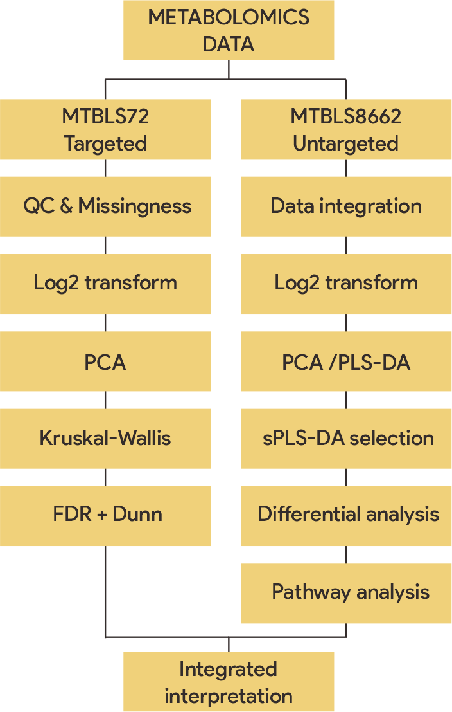
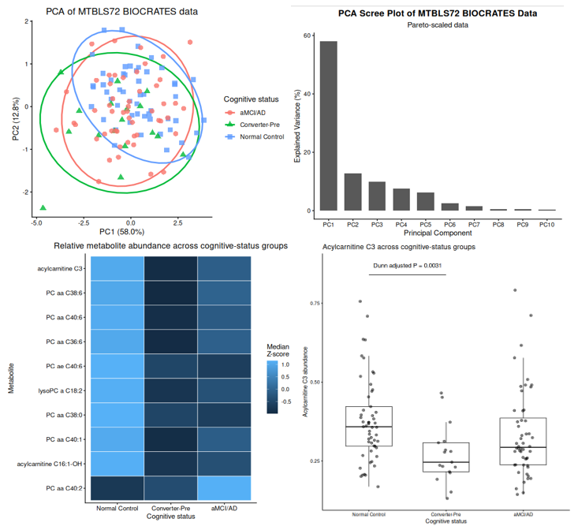
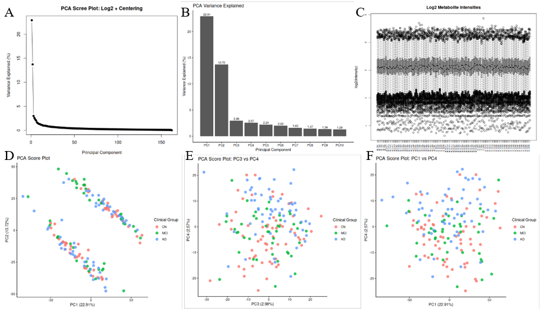
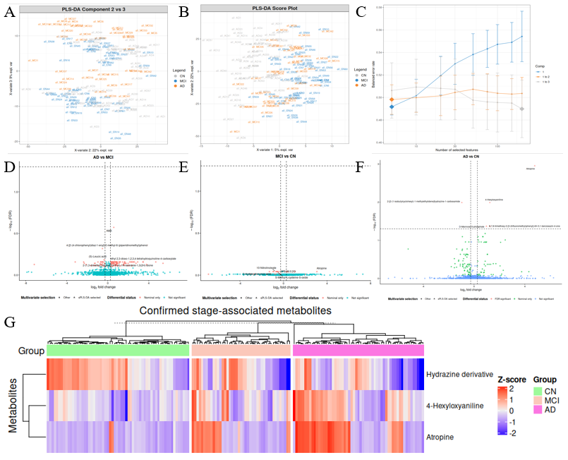
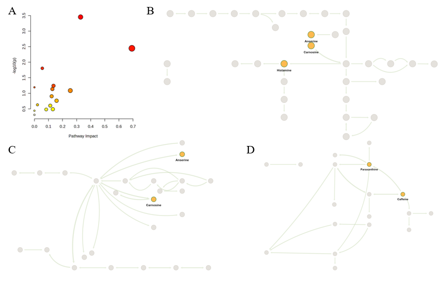
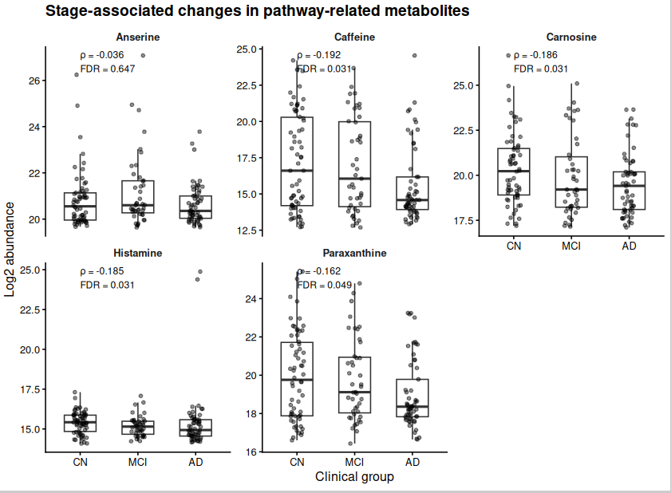

# COMPUTATIONAL METABOLOMICS ANALYSIS OF ALZHEIMER’S DISEASE: INTEGRATING TARGETED PLASMA LIPIDOMICS AND UNTARGETED URINARY METABOLOMICS
### Prananda Imammuddin Dzaki
## Abstract
Background: Alzheimer’s disease (AD) is associated with complex metabolic alterations that may vary across clinical stages. Metabolomics provides complementary approaches for characterizing these alterations through targeted and untargeted analyses. This study investigated AD-associated metabolic patterns using two publicly available metabolomics datasets.

Methods: MTBLS72 comprised targeted plasma metabolomics data generated using the BIOCRATES Absolute-IDQ P180 platform. Ten metabolite features were analyzed across Normal Control, Converter-Pre, and aMCI/AD groups using log2 transformation, principal component analysis (PCA), Kruskal-Wallis testing, Benjamini-Hochberg false discovery rate (FDR) correction, and Dunn’s post-hoc analysis. MTBLS8662 comprised untargeted urinary LC-MS/MS data from 162 participants, including 62 cognitively normal (CN), 43 mild cognitive impairment (MCI), and 57 AD individuals, with 2,140 metabolite features. PCA, PLS-DA, sparse PLS-DA, differential analysis, pathway enrichment, and stage-associated analyses were performed.

Results: In MTBLS72, Acylcarnitine C3 was the only feature that remained significant after FDR correction (FDR = 0.0267), with the strongest difference between Converter-Pre and Normal Control (Dunn’s adjusted P = 0.0031). In MTBLS8662, PCA showed substantial overlap among clinical groups, while supervised analysis demonstrated modest discrimination. Five metabolites remained FDR-significant in AD versus CN. Histidine metabolism was the only pathway significant after FDR correction (FDR = 0.0282), while caffeine and paraxanthine showed decreasing patterns across CN, MCI, and AD.

Conclusion: Targeted and untargeted metabolomics provided complementary perspectives on AD-associated metabolic alterations, from focused metabolite-level signals to broader pathway and stage-associated patterns. The findings remain exploratory and do not establish validated biomarkers or longitudinal metabolic progression.

---

## INTRODUCTION
### 1.1	Alzheimer’s Disease and the Need for Metabolic Biomarkers
Alzheimer’s disease (AD) is a progressive neurodegenerative disorder characterized by cognitive decline and complex molecular alterations that develop across different clinical stages. Pathophysiological changes may begin years or even decades before the onset of clinically apparent dementia, creating a need for biomarkers that can detect early disease-related alterations. Mild cognitive impairment (MCI), particularly amnestic MCI, represents an important clinical state because it may reflect an intermediate stage between cognitively normal aging and AD dementia. Metabolic alterations may therefore be detectable during MCI or even during preclinical stages of AD, before the development of established dementia (Albert et al., 2011; Sperling et al., 2011; Mapstone et al., 2014; Wang et al., 2014). The biological and clinical heterogeneity of AD further supports the use of approaches capable of capturing systemic molecular changes associated with cognitive status and disease progression (Badhwar et al., 2020).

Metabolomic studies have reported differences in circulating metabolites among cognitively normal individuals, people with MCI, and individuals with AD. For example, plasma metabolite panels have distinguished AD or amnestic MCI from cognitively normal participants, while urinary metabolic phenotyping has identified features associated with AD and MCI (Wang et al., 2014; Mapstone et al., 2017; Nho et al., 2019; Xu et al., 2020). Nevertheless, the reproducibility and clinical interpretation of individual metabolite biomarkers can be affected by differences in cohort composition, biofluid, analytical platform, sample handling, and statistical methodology.

### 1.2	Metabolomics as an Approach to Investigate AD
Metabolomics provides a comprehensive approach for characterizing low-molecular-weight metabolites that represent downstream consequences of genetic, transcriptional, proteomic, environmental, nutritional, and physiological processes. Because metabolites are relatively close to the biochemical phenotype, metabolomic profiling can provide information that complements genomic, transcriptomic, and proteomic analyses (Patti et al., 2012; Wishart, 2019). Metabolites may therefore provide a functional molecular readout of altered cellular pathways and systemic physiological states.

Biofluids such as plasma, serum, cerebrospinal fluid, and urine are widely used in metabolomics. Plasma and serum can provide information about systemic metabolism, whereas urine contains filtered and excreted metabolites and can provide a relatively accessible and scalable matrix for biomarker discovery. Compared with tissue sampling, collection of plasma and urine is substantially less invasive and is more feasible in clinical and population-based studies (Lindon et al., 2007; Montef823; Mapstone et al., 2017; Zhang et al., 2020). However, the biological interpretation of a biofluid metabolome depends on the matrix: plasma may reflect circulating systemic processes, whereas urine may be influenced by renal handling, hydration, diet, medication, and excretion.

The MTBLS8662 study similarly describes the metabolome as a phenotype reflecting genetic, transcriptomic, proteomic, and environmental influences. The dataset investigates urinary metabolic phenotypes and potential biomarkers in cognitively normal participants, individuals with MCI, and individuals with AD using an untargeted ultra-performance liquid chromatography–tandem mass spectrometry approach (Wang et al., 2024; MetaboLights, 2024). Thus, urine metabolomics offers advantages in accessibility and scalability, but its findings require careful consideration of preanalytical and physiological sources of variation.

### 1.3	Targeted and Untargeted Metabolomics

Metabolomics studies can broadly be performed using targeted or untargeted approaches. Targeted metabolomics focuses on a predefined set of chemically characterized metabolites and generally provides relatively precise, quantitative, and reproducible measurements. This strategy is particularly useful when metabolites or biochemical pathways have been selected on the basis of prior biological knowledge or when candidate biomarkers require validation (Liesenfeld et al., 2013; Cajka & Fiehn, 2016). Untargeted metabolomics attempts to measure a broad range of detectable molecular features without restricting the analysis to a fully predefined metabolite list. It can therefore facilitate the discovery of previously unanticipated metabolic alterations, although many detected features may initially remain unidentified or only partially annotated. Untargeted workflows are commonly used for hypothesis generation, metabolic fingerprinting, biomarker discovery, and pathway exploration (Creek et al., 2011; Blaise et al., 2013; Beger et al., 2016). Targeted and untargeted metabolomics should not necessarily be considered competing strategies. Instead, they provide complementary analytical perspectives. Untargeted analyses can identify candidate features and pathways, whereas targeted analyses can subsequently confirm and accurately quantify selected metabolites using validated assays. Conversely, targeted assays can provide robust measurements of biologically relevant metabolites that may be missed or poorly quantified in untargeted workflows (Liesenfeld et al., 2013; Patti et al., 2012).

### 1.4	Rationale for Integrating MTBLS72 and MTBLS8662
This complementarity is illustrated by two publicly available Alzheimer’s disease metabolomics datasets. MTBLS72 contains plasma metabolomics data from a study investigating antecedent memory impairment in older adults. The present analysis focuses on the BIOCRATES Absolute-IDQ P180 targeted platform and evaluates 10 available metabolite features across Normal Control, Converter-Pre, and aMCI/AD groups. Mini Report Metabolomics Alzhei… In contrast, MTBLS8662 contains urinary untargeted LC-MS/MS data from 162 participants, comprising 62 cognitively normal individuals, 43 individuals with MCI, and 57 individuals with AD, with 2,140 metabolite features reconstructed for the present analysis. 

The two datasets therefore provide complementary analytical perspectives. MTBLS72 allows evaluation of specific targeted metabolic features associated with cognitive status, whereas MTBLS8662 enables a broader exploration of global metabolic structure, discriminative features, differential metabolites, metabolic pathways, and stage-associated patterns. In MTBLS72, Acylcarnitine C3 was the only analyzed feature that remained significant after FDR correction, with a particular difference between Converter-Pre and Normal Control. Mini Report Metabolomics Alzhei… In MTBLS8662, the broader untargeted analysis identified five metabolites that remained significant after FDR correction in the AD versus CN comparison, while pathway analysis highlighted histidine metabolism as the strongest pathway-level signal.

However, findings from these datasets should not be interpreted as directly equivalent measurements. They differ in biofluid, analytical platform, metabolite coverage, sample composition, and clinical grouping. Therefore, the purpose of integrating the datasets is not to statistically pool their measurements, but to examine how different metabolomics strategies can reveal complementary aspects of metabolic alterations associated with AD and cognitive status.

### 1.5	Research Objectives 

The overall objective of this study was to characterize metabolic alterations associated with Alzheimer’s disease using complementary targeted plasma and untargeted urinary metabolomics datasets through an integrated computational metabolomics workflow. Specific objectives were:

1)	To characterize metabolic patterns associated with cognitive status using targeted plasma metabolomics data from MTBLS72 and untargeted urinary metabolomics data from MTBLS8662.
2)	To identify differential and discriminative metabolites associated with cognitive status and Alzheimer’s disease.
3)	To investigate biological pathways and stage-associated metabolic patterns using the untargeted MTBLS8662 dataset.
4)	To compare the analytical information provided by targeted and untargeted metabolomics in the context of Alzheimer’s disease research.

---

## METHODS

### 2.1	Overall Study Design

Figure 1. Overall metabolomics Alzheimer design study.

### 2.2	Dataset 1: MTBLS72

The MTBLS72 dataset originates from a study on plasma lipidomics identifying antecedent memory impairment in older adults, focusing on cognitive statuses: Normal Control, Converter-Pre, and aMCI/AD. The analysis centered on BIOCRATES Absolute-IDQ P180 data, obtained via targeted mass spectrometry using flow-injection tandem MS and scheduled MRM. Out of 187 source profiles mapped to clinical metadata, 65 profiles with missing values across all 10 features were excluded, leaving 122 complete profiles (53 Normal Control, 17 Converter-Pre, and 52 aMCI/AD) evaluated for ten metabolite features, including Acylcarnitine C16:1-OH, Acylcarnitine C3, lysoPC a C18:2, several phosphatidylcholines, and PC ae C40:6. The data subsequently underwent log2 transformation, sample correlation/QC, PCA, Kruskal-Wallis test, Benjamini-Hochberg FDR correction, and Dunn post-hoc analysis, alongside effect size estimation to interpret the magnitude of inter-group differences.

### 2.3	Dataset 2: MTBLS8662
The MTBLS8662 dataset stems from a cross-sectional study on urine metabolomics phenotyping and urinary biomarker exploration in mild cognitive impairment and Alzheimer's disease, involving 162 participants (57 AD, 43 MCI, and 62 CN). Urine samples were collected at China-Japan Friendship Hospital and analyzed using LC-MS/MS in positive and negative reverse-phase modes. For reanalysis, three supplementary data sheets representing AD versus CN, MCI versus CN, and AD versus MCI were integrated based on 2,140 shared Compound_IDs into a single master abundance matrix of 2,140 metabolites × 162 samples, with no duplicate Compound_IDs, missing values, zero values, or infinite values. Subsequently, clinical stages were represented ordinally as CN = 0, MCI = 1, and AD = 2 for stage association analysis, serving strictly as a clinical sequence representation rather than a measure of time or longitudinal progression evidence.

### 2.4	Data Preprocessing and Quality Control
Since the two datasets possess distinct characteristics and platforms, data preprocessing was conducted in a dataset-specific manner. For MTBLS72, profiles with complete measurements across the ten analyzed BIOCRATES features were retained, and the resulting matrix was log2-transformed prior to multivariate and statistical analyses. For MTBLS8662, since the original study had already performed total spectral intensity normalization, QC1-based relative peak-area standardization, and the removal of metabolites with a QC coefficient of variation greater than 30%, the current reanalysis did not apply an additional global normalization step. Instead, it directly applied a log2 transformation to the reconstructed abundance matrix, while sample-level distributions and pairwise correlations were examined to evaluate overall data consistency.

### 2.5	Statistical and Multivariate Analysis
For MTBLS72, PCA was performed to evaluate the global structure of targeted metabolite profiles. Differences among Normal Control, Converter-Pre, and aMCI/AD were assessed using Kruskal-Wallis tests, followed by Benjamini-Hochberg correction and Dunn post-hoc analysis where appropriate. For MTBLS8662, PCA was performed using mean-centered log2-transformed data. PLS-DA and sparse PLS-DA were subsequently applied to evaluate supervised discrimination and prioritize informative features. Model tuning was conducted using repeated M-fold cross-validation with 10 folds, 20 repeats, a balanced error rate, and maximum-distance classification. The final sPLS-DA model retained five features and was interpreted primarily as an exploratory feature-selection model rather than a clinical diagnostic classifier. Differential analysis of MTBLS8662 was performed independently for AD versus CN, MCI versus CN, and AD versus MCI using Wilcoxon rank-sum tests. P-values were adjusted using the Benjamini-Hochberg procedure. Metabolites with FDR < 0.05 were considered statistically robust, while an exploratory set was defined using P < 0.05 and |log2FC| ≥ log2(1.2).

### 2.6	Pathway and Stage-associated Analysis
Pathway analysis was performed for AD versus CN using the exploratory differential metabolite set from MTBLS8662. Metabolites were mapped to Homo sapiens KEGG pathways using MetaboAnalyst with hypergeometric enrichment and degree centrality for pathway topology. Pathways with FDR < 0.05 were considered statistically significant. 

Stage-associated patterns were evaluated by assigning ordinal scores of 0, 1, and 2 to CN, MCI, and AD, respectively. Spearman correlation was used to evaluate monotonic associations between metabolite abundance and clinical stage, while the Jonckheere-Terpstra test was used as a sensitivity analysis for ordered differences. 

### 2.7	Integrated Interpretation Framework
Findings from the two datasets were interpreted according to their analytical context rather than directly pooled. MTBLS72 was used to characterize targeted plasma metabolite differences, whereas MTBLS8662 was used to investigate broader urinary metabolic patterns. Candidate metabolites and metabolic signals were interpreted according to statistical significance, multivariate relevance, pathway context, stage association, and annotation evidence where applicable. Because the two datasets differed in biological matrix, analytical platform, metabolite coverage, and clinical group definitions, cross-dataset comparison was performed qualitatively rather than through direct statistical integration.

---

## 3.	RESULTS AND DISCUSSION

### 3.1	Targeted Plasma Metabolomics

Figure 2. Targeted plasma metabolomic profiles across cognitive-status groups in the MTBLS72 BIOCRATES dataset. (A) PCA score plot based on Pareto-scaled metabolite abundances, showing the distribution of Normal Control, Converter-Pre, and aMCI/AD groups. (B) Percentage of variance explained by the first ten principal components. (C) Relative abundance patterns of the ten analyzed BIOCRATES metabolite features across cognitive-status groups, shown as median Z-scores. (D) Distribution of Acylcarnitine C3 abundance across cognitive-status groups. The Converter-Pre group showed lower Acylcarnitine C3 abundance than the Normal Control group, with a significant difference in Dunn’s post-hoc test (adjusted P = 0.0031).

PCA revealed that the profile of 10 metabolites exhibits a strong global structure, with PC1 and PC2 explaining approximately 70.8% of the total variance after Pareto scaling. However, the three cognitive status groups still exhibited considerable overlap in the PCA space; thus, no clear global separation was observed among them based on these 10 features. For C3, median abundance followed the pattern: Normal Control > aMCI/AD > Converter-Pre. Dunn's post-hoc test showed that the most prominent difference existed between Converter-Pre and Normal Control (adjusted P=0.0031, with a Wilcoxon effect size of approximately r=0.381). PC aa C38:6 and PC aa C40:6 showed nominal differences (P<0.05), but neither passed the 5% FDR threshold.

The results indicate that Acylcarnitine C3 is the most consistently differentiating feature among the 10 analyzed BIOCRATES features. The Converter-Pre group exhibited lower C3 abundance compared to Normal Control, whereas the aMCI/AD group showed intermediate values. The heatmap also revealed a descriptive pattern relatively similar across several phosphatidylcholines and lysophosphatidylcholines, though these patterns were not entirely supported by statistical significance after multiple testing correction. These findings should be viewed as exploratory. The analyzed dataset only covers 10 features on MAF with 122 complete source profiles; hence, these results are insufficient to establish C3 as an Alzheimer's biomarker or to conclude any longitudinal metabolic changes.

### 3.2	Global Metabolic Structure of Urine Metabolomics Profiles

Figure 3. Global metabolic structure of urine metabolomics profiles across cognitively normal (CN), mild cognitive impairment (MCI), and Alzheimer’s disease (AD) groups. (A) PCA scree plot showing the variance explained by individual principal components. (B) Percentage of variance explained by the first 10 principal components. (C) Distribution of log2-transformed metabolite intensities across samples. (D) PCA score plot of PC1 versus PC2, explaining 22.91% and 13.72% of the total variance, respectively. (E) PCA score plot of PC3 versus PC4. (F) Distribution of PC4 scores across clinical groups.

Principal component analysis (PCA) was initially performed to evaluate the global structure of urinary metabolomic profiles across cognitively normal (CN), mild cognitive impairment (MCI), and Alzheimer’s disease (AD) groups. The first principal component (PC1) explained 22.91% of the total variance, followed by PC2, which explained 13.72%. Thus, the first two components accounted for 36.63% of the total variance. PC3 and PC4 explained substantially smaller proportions of variance, at 2.98% and 2.57%, respectively (Figure 3A–B). The distribution of log2-transformed metabolite intensities showed a broad but relatively structured range across the 162 samples (Figure 3C). The log2 transformation was important because the original metabolite abundance values spanned several orders of magnitude. After transformation, the intensity distribution was more suitable for multivariate analysis and reduced the influence of extremely abundant metabolites.

The PC1 versus PC2 score plot showed substantial overlap among CN, MCI, and AD samples (Figure 3D). No clear linear separation corresponding to the clinical sequence CN → MCI → AD was observed. This finding suggests that the overall urinary metabolome is influenced by substantial inter-individual variation and that Alzheimer’s-associated metabolic alterations may involve only a subset of the measured metabolites rather than producing a uniform global shift in the entire metabolome. The additional PC3 versus PC4 projection also showed considerable overlap among the three groups (Figure 3E). However, examination of PC4 scores revealed a significant difference among clinical groups, particularly between AD and CN and between AD and MCI. Therefore, although the dominant sources of variation captured by PC1 and PC2 did not clearly separate the clinical groups, lower-variance components contained information associated with disease status.

This observation is important for interpreting subsequent supervised analyses. The absence of strong separation in PCA does not necessarily indicate an absence of disease-associated metabolic alterations. Instead, it suggests that the metabolic phenotype associated with AD is relatively subtle compared with the total biological variation present in urine. This is consistent with the original MTBLS8662 study, which identified numerous differential metabolites despite the heterogeneous nature of the overall metabolome. The original study included 57 AD, 43 MCI, and 62 CN participants and identified 2,140 metabolite features from urinary LC-MS/MS profiling. Overall, Figure 3 indicates that AD-associated metabolic alterations are not represented by a simple global shift in urinary metabolome, but rather by specific metabolic features embedded within a highly heterogeneous metabolic background.

### 3.3	Multivariate Discrimination and Differential Metabolite Signatures

Figure 4. Multivariate discrimination and differential metabolite signatures across clinical groups. (A) PLS-DA score plot showing samples projected onto components 2 and 3. (B) PLS-DA score plot showing the first two latent components. (C) Cross-validated model performance according to the number of selected features. (D–F) Volcano plots showing differential metabolite profiles for AD versus MCI, MCI versus CN, and AD versus CN, respectively. Metabolites are classified according to statistical significance and multivariate selection by sPLS-DA. (G) Heatmap of selected AD-associated metabolites identified by multivariate analysis, showing row-wise Z-score abundance across individual samples.

To identify metabolic features that could distinguish the clinical groups despite the substantial overlap observed in PCA, supervised multivariate analyses were subsequently performed using PLS-DA and sparse PLS-DA (sPLS-DA). The PLS-DA score plots showed some degree of group structure, but considerable overlap remained among CN, MCI, and AD samples (Figure 4A–B). Cross-validation further indicated that the classification performance was modest. The balanced error rate (BER) remained approximately 0.49 for the selected model, indicating that the metabolomic profiles did not provide strong three-class discrimination when considered as a supervised classification problem. This result is consistent with the PCA findings. Rather than producing a highly distinct metabolic fingerprint for each clinical stage, the dataset appears to contain overlapping metabolic profiles with a smaller subset of informative metabolites. Consequently, supervised analysis was used primarily for feature prioritization rather than as evidence of a clinically validated classification model.

Sparse PLS-DA identified a small set of high-priority metabolites with relatively stable selection across repeated cross-validation. Three features showed particularly high selection stability: Atropine and 4-Hexyloxyaniline were selected in essentially all resampling iterations, while the hydrazine derivative showed approximately 90% selection stability. D-Mannose 6-phosphate and Nonanoic acid were also selected in the model but showed lower selection stability. Differential analysis provided an additional layer of evidence. For AD versus CN, five metabolites remained statistically significant after Benjamini-Hochberg correction:
-	Atropine, increased in AD;
-	4-Hexyloxyaniline, increased in AD;
-	the hydrazine derivative, decreased in AD;
-	6,7,8-trimethoxy-2-[3-(trifluoromethyl)phenyl]-4H-3,1-benzoxazin-4-one, increased in AD; and
-	D-Mannose 6-phosphate, increased in AD.

Among these, Atropine exhibited the strongest effect, with an approximately 27-fold higher mean abundance in AD compared with CN and a large log2 fold change. However, the biological interpretation of Atropine requires caution because it is a drug-like/xenobiotic compound and urinary abundance may be influenced by medication or environmental exposure. Interestingly, the number of nominally differential metabolites was substantially larger than the number that survived FDR correction. Using a nominal threshold of P < 0.05 together with an effect-size threshold of |log2FC| ≥ log2(1.2), 114 metabolites were identified for AD versus CN. In contrast, no metabolites remained FDR-significant for either MCI versus CN or AD versus MCI under the same stringent multiple-testing framework.

This difference suggests that AD versus CN represents the strongest detectable metabolic contrast in the dataset, whereas metabolic differences involving MCI are weaker and more heterogeneous. It also explains why the subsequent pathway analysis used the broader exploratory metabolite set rather than only the five FDR-significant metabolites. The heatmap of selected metabolites further demonstrated that the abundance patterns of the prioritized metabolites were heterogeneous across individual samples (Figure 4G). Although group-level patterns were apparent, individual samples frequently showed deviations from the group trend. This reinforces the conclusion that AD-associated metabolic alterations are not uniformly expressed across all patients.

Taken together, Figure 4 demonstrates that the dataset contains specific metabolite signatures associated with AD, but the global classification signal is relatively weak. Multivariate selection therefore provides a useful complementary approach to univariate differential analysis by identifying features that are repeatedly informative even when overall group separation is incomplete.

### 3.4	Pathway Enrichment and Metabolic Context of AD-associated Metabolites 

Figure 5. Pathway enrichment and metabolic pathway mapping of differential metabolites in AD versus CN. (A) Pathway enrichment analysis based on the exploratory set of 114 differential metabolites, showing pathway significance and topology impact. (B) Histidine metabolism, the only pathway reaching statistical significance after false discovery rate correction, with histamine, carnosine, and anserine identified among the mapped metabolites. (C) β-Alanine metabolism and (D) caffeine metabolism, which showed nominal pathway enrichment but did not remain significant after FDR correction. Highlighted nodes indicate metabolites included in the differential metabolite input list.

Because individual metabolite-level analysis can produce a fragmented biological interpretation, the differential metabolite set was subsequently examined at the pathway level. An exploratory set of 114 metabolites from the AD versus CN comparison was submitted to pathway analysis. Of these, 56 metabolites could be mapped by the pathway-analysis platform, corresponding to approximately 49.1% of the input list. The pathway enrichment analysis identified histidine metabolism as the only pathway that remained statistically significant after FDR correction (Figure 5A). Histidine metabolism contained three mapped metabolites from the differential metabolite list: histamine, carnosine, and anserine (Figure 5B). The pathway showed a raw P value of 0.000353, an FDR of 0.0282, and a pathway impact of approximately 0.328.

The presence of multiple related metabolites within the same pathway provides stronger biological context than considering each metabolite independently. Histidine metabolism encompasses metabolic processes involving histidine-derived compounds, including histamine and histidine-containing dipeptides. The mapping of histamine and carnosine to the KEGG histidine pathway is consistent with the pathway topology represented in the database. However, the direction of individual metabolite changes was not uniform. Histamine showed a strong increase in mean abundance in AD relative to CN, whereas carnosine and anserine showed lower abundance. Therefore, the pathway-level result should not be interpreted as a simple activation or suppression of histidine metabolism. Instead, it suggests that multiple metabolites belonging to the pathway are differentially distributed between AD and CN. This distinction is particularly important because pathway enrichment based on metabolite lists identifies statistical overrepresentation, rather than directly measuring metabolic flux. Consequently, the result supports the statement that histidine metabolism is associated with the AD metabolic phenotype, but does not establish that the overall pathway is biologically activated or inhibited.

Two additional pathways showed nominal enrichment: β-alanine metabolism and caffeine metabolism (Figure 5A, C–D). β-Alanine metabolism contained carnosine and anserine, both of which showed lower abundance in AD relative to CN. Caffeine metabolism contained caffeine and paraxanthine, both of which showed lower abundance in AD. Neither pathway remained statistically significant after FDR correction. Therefore, these pathways should be considered exploratory rather than confirmed pathway-level findings. The caffeine-related result should also be interpreted cautiously because caffeine and its metabolites can be strongly influenced by dietary intake, medication, and individual consumption patterns. Likewise, the presence of drug-like compounds among the differential metabolite set highlights the importance of considering exogenous exposures when interpreting untargeted urine metabolomics.

Overall, Figure 5 shifts the interpretation from individual metabolite differences toward a broader biological context. The strongest pathway-level evidence in this analysis points toward histidine-related metabolism, while β-alanine and caffeine metabolism provide additional exploratory signals.

### 3.5	Stage-associated Patterns of Pathway-related Metabolites

Figure 6. Stage-associated patterns of pathway-related metabolites across CN, MCI, and AD groups. Boxplots show log2-transformed metabolite abundance with individual observations overlaid. Spearman correlation was used to assess the association between metabolite abundance and ordered clinical stage (CN = 0, MCI = 1, AD = 2), with Benjamini-Hochberg correction. Jonckheere-Terpstra testing was additionally used as a sensitivity analysis for ordered differences across clinical groups. Caffeine and paraxanthine showed consistent decreases across CN, MCI, and AD, whereas carnosine showed a non-monotonic stage-associated pattern. Histamine showed a weak inverse association with stage and marked heterogeneity in the AD group, while anserine showed no significant stage association.

To determine whether pathway-related metabolites were associated with the ordered clinical stages, CN, MCI, and AD were represented as ordinal scores of 0, 1, and 2, respectively. Spearman correlation was used to evaluate monotonic associations between metabolite abundance and clinical stage, while the Jonckheere-Terpstra test was used as a sensitivity analysis for ordered differences. Five metabolites identified from the pathway analysis showed significant Spearman associations after FDR correction: caffeine, carnosine, histamine, and paraxanthine, while anserine did not remain significant. The corresponding results are summarized in Figure 6.

Caffeine and paraxanthine showed the clearest decreasing pattern across clinical groups. Median caffeine abundance decreased from 16.6 in CN to 16.1 in MCI and 14.6 in AD, while paraxanthine decreased from 19.8 to 19.1 and 18.4, respectively. Their negative Spearman correlations were statistically significant after FDR correction, with ρ = −0.192 for caffeine and ρ = −0.162 for paraxanthine. The Jonckheere-Terpstra analysis provided consistent evidence for ordered differences. These results suggest that caffeine-related metabolites may reflect a metabolic pattern associated with clinical stage. Nevertheless, because caffeine metabolism is highly dependent on exogenous intake and metabolic capacity, the observed pattern should not be interpreted as a disease-specific biochemical mechanism without information on dietary caffeine consumption, medication, or relevant metabolic covariates.

Carnosine displayed a different pattern. Its median abundance decreased from 20.2 in CN to 19.2 in MCI but slightly increased to 19.4 in AD. Thus, the pattern was not strictly monotonic despite the significant negative Spearman association (ρ = −0.186, FDR = 0.031). The result therefore suggests an overall stage-associated decrease, but not a simple continuous decline from CN to AD. The behavior of histamine is particularly interesting. The median abundance decreased progressively from 15.4 in CN to 15.1 in MCI and 14.9 in AD, resulting in a negative Spearman correlation (ρ = −0.185, FDR = 0.031). However, the AD group showed substantial heterogeneity, including two extreme observations with exceptionally high raw abundance. These observations strongly influenced the mean abundance of histamine in AD and explain an apparent discrepancy between the mean-based differential analysis and the median-based stage analysis.

This is an important analytical finding. In the AD versus CN differential analysis, histamine appeared strongly increased based on the mean abundance, with an estimated fold change of approximately 19.9. However, the group median actually decreased across CN → MCI → AD. Therefore, the apparent AD increase was largely driven by a small number of extreme AD observations rather than a population-wide shift in histamine abundance. Consequently, the histamine result should not be described simply as "histamine increased in AD." A more accurate interpretation is that histamine exhibited substantial inter-individual heterogeneity in AD, with a small subset of AD samples showing exceptionally high abundance.

Finally, anserine did not demonstrate evidence for a stage-associated relationship. Its median abundance was approximately 20.6 in both CN and MCI and decreased only slightly to 20.4 in AD. The Spearman correlation was close to zero (ρ = −0.036, FDR = 0.647), and the Jonckheere-Terpstra test was also non-significant. Taken together, Figure 6 demonstrates that pathway-related metabolites do not necessarily follow the same trajectory across clinical stages. The results can therefore be divided into several patterns:

| Metabolite | Stage Pattern | Interpretation |
| :--- | :--- | :--- |
| Caffeine | CN > MCI > AD | Consistent stage-associated decrease |
| Paraxanthine | CN > MCI > AD | Consistent stage-associated decrease |
| Carnosine | CN > MCI < AD | Non-monotonic, overall inverse association |
| Histamine | Median CN > MCI > AD, but extreme AD values | High heterogeneity, outlier-driven mean increase |
| Anserine | Approximately stable | No evidence of stage association |

These findings reinforce the importance of distinguishing differential abundance between two groups from ordered stage-associated change. A metabolite can be significantly different between AD and CN without representing a progressive CN → MCI → AD pattern. Conversely, a metabolite may show a relatively subtle but consistent stage-associated change without being among the strongest AD-versus-CN biomarkers.

### 3.6	Integrated Interpretation of the Four Analyses

Taken together, the four analyses provide a coherent picture of the MTBLS8662 urinary metabolome.First, PCA demonstrated substantial overlap among CN, MCI, and AD, indicating that Alzheimer’s-associated metabolic alterations do not dominate the overall urinary metabolic variance. Second, supervised multivariate and differential analyses identified a smaller subset of metabolites associated with AD. However, the relatively weak cross-validated classification performance indicates that these metabolites should be regarded as exploratory molecular signatures rather than clinically validated diagnostic biomarkers. Third, pathway analysis provided biological context and identified histidine metabolism as the strongest pathway-level signal after multiple-testing correction. β-alanine and caffeine metabolism represented additional exploratory pathways. Fourth, stage-associated analysis revealed that pathway-related metabolites do not behave uniformly across CN, MCI, and AD. Caffeine and paraxanthine showed relatively consistent decreases, whereas carnosine exhibited a non-monotonic pattern and histamine was characterized by marked AD heterogeneity.

Overall, the integrated analysis supports a model in which Alzheimer’s disease is associated with selective and heterogeneous alterations in urinary metabolism rather than a uniform global metabolic shift. The strongest evidence comes from the convergence of multivariate feature selection, differential abundance, pathway enrichment, and stage-associated analysis. At the same time, the cross-sectional design prevents these patterns from being interpreted as direct evidence of longitudinal metabolic progression. The CN → MCI → AD ordering should therefore be understood as an ordered clinical-stage framework, rather than a demonstrated temporal trajectory.

This distinction is particularly important because the original MTBLS8662 study was also designed as a cross-sectional urinary metabolomics investigation involving CN, MCI, and AD groups rather than a longitudinal follow-up study.

| Aspect | MTBLS72 | MTBLS8662 |
| :--- | :--- | :--- |
| Analytical strategy | Targeted | Untargeted |
| Biological matrix | Plasma | Urine |
| Coverage | Narrow, predefined | Broad |
| Main strength | Focused detection | Discovery |
| Global structure | Relatively compact | Highly heterogeneous |
| Main signal | Acylcarnitine C3 | Multiple AD-associated metabolites |
| Pathway insight | Limited | Histidine, $\beta$-alanine, caffeine |
| Stage analysis | Cognitive-status comparison | CN-MCI-AD ordered analysis |
| Interpretation | Specific metabolic feature | Broader metabolic context |

The two datasets demonstrated complementary analytical capabilities rather than identical metabolic signatures. MTBLS72 provided a focused view of predefined plasma metabolites and identified Acylcarnitine C3 as the strongest discriminatory feature among the analyzed BIOCRATES metabolites. In contrast, MTBLS8662 captured a substantially broader urinary metabolic space and identified multiple AD-associated metabolites, pathway-level alterations, and stage-associated patterns. These differences reflect the distinct analytical coverage and biological matrices of the two datasets rather than necessarily representing contradictory metabolic findings.

## 4.	CONCLUSION

This integrated computational analysis demonstrates that targeted and untargeted metabolomics provide complementary perspectives on metabolic alterations associated with Alzheimer’s disease. Targeted plasma metabolomics in MTBLS72 identified Acylcarnitine C3 as the strongest statistically supported feature among the analyzed BIOCRATES metabolites, particularly distinguishing Converter-Pre from Normal Control. Untargeted urinary metabolomics in MTBLS8662 revealed a broader and more heterogeneous metabolic landscape, with five metabolites remaining significant after FDR correction in AD versus CN and histidine metabolism emerging as the strongest pathway-level signal. Stage-associated analysis further indicated that selected metabolites, particularly caffeine and paraxanthine, exhibited ordered patterns across CN, MCI, and AD, although these patterns should not be interpreted as longitudinal progression. Together, the two datasets illustrate how targeted and untargeted computational metabolomics can complement each other by providing focused metabolite-level evidence and broader pathway-level context.

## REFERENCES

Albert, M. S., DeKosky, S. T., Dickson, D., Dubois, B., Feldman, H. H., Fox, N. C., Gamst, A., Holtzman, D. M., Jagust, W. J., Petersen, R. C., Snyder, P. J., Carrillo, M. C., Thies, B., & Phelps, C. H. (2011). The diagnosis of mild cognitive impairment due to Alzheimer’s disease: Recommendations from the National Institute on Aging–Alzheimer’s Association workgroups. Alzheimer’s & Dementia, 7(3), 270–279. https://doi.org/10.1016/j.jalz.2011.03.008

Badhwar, A., McFall, G. P., McDermott, K. L., & Taler, V. (2020). A multiomics approach to heterogeneity in Alzheimer’s disease: Focused review and roadmap. Brain, 143(8), 2348–2370. https://doi.org/10.1093/brain/awaa141

Beger, R. D., Dunn, W., Schmidt, M. A., Gross, S. S., Kirwan, J. A., Cascante, M., Brennan, L., Wishart, D. S., Oresic, M., & Hankemeier, T. (2016). Metabolomics enables precision medicine: “A White Paper, Community Perspective.” Metabolomics, 12, Article 149. https://doi.org/10.1007/s11306-016-1091-6

Blaise, B. J., Correia, G., Dumas, M.-E., Shintu, L., Still, C., & Ebbels, T. M. D. (2013). Statistical analysis in metabolic phenotyping. Nature Protocols, 8(8), 1665–1676. https://doi.org/10.1038/nprot.2013.101

Cajka, T., & Fiehn, O. (2016). Toward MRM-based targeted metabolomics. Analytical Chemistry, 88(1), 524–545. https://doi.org/10.1021/acs.analchem.5b04480

Creek, D. J., Dunn, W. B., Fiehn, O., Griffin, J. L., Hall, R. D., Lei, Z., Macbeth, S., & Takáts, Z. (2011). Metabolite identification: Are you sure? And how do your peers gauge your confidence? Metabolomics, 7, 1–5. https://doi.org/10.1007/s11306-010- ಕ?
https://www.ebi.ac.uk/metabolights/editor/MTBLS8662

Liesenfeld, D. B., Habermann, N., Owen, R. W., Scalbert, A., Ulrich, C. M., & Scheringer, M. (2013). Review of mass spectrometry-based targeted and untargeted metabolomics in cancer research. Metabolomics, 9, 1087–1103. https://doi.org/10.1007/s11306-013-0522-6

Lindon, J. C., Holmes, E., & Nicholson, J. K. (2007). Metabonomics techniques and applications to pharmaceutical research and development. Pharmacogenomics, 8(6), 691–699. https://doi.org/10.2217/14622416.8.6.691

Mapstone, M., Cheema, A. K., Fiandaca, M. S., Zhong, X., Mhyre, T. R., MacArthur, L. H., Hall, W. J., Fisher, S. G., Peterson, D. R., Haley, J. M., Nazar, M. D., Rich, S. A., Motsinger-Reif, A. A., & Federoff, H. J. (2017). What success can teach us about failure: The plasma metabolome of older adults with superior memory and lessons for Alzheimer’s disease. Neurobiology of Aging, 51, 148–155. https://doi.org/10.1016/j.neurobiolaging.2016.11.007

MetaboLights. (2024). MTBLS8662: Urine metabolomics phenotyping and urinary biomarker exploratory in mild cognitive impairment and Alzheimer’s disease. EMBL-EBI. 

Nho, K., Lee, S., Jung, H. J., Kim, S., Bressler, J., choi, S. H., et al. (2019). Altered bile acid profile in mild cognitive impairment and Alzheimer’s disease: Relationship to neuroimaging and CSF biomarkers. Alzheimer’s & Dementia, 15(2), 232–244. https://doi.org/10.1016/j.jalz.2018.08.012

Patti, G. J., Yanes, O., & Siuzdak, G. (2012). Innovation: Metabolomics: The apogee of the omics trilogy. Nature Reviews Molecular Cell Biology, 13(4), 263–269. https://doi.org/10.1038/nrm3314

Sperling, R. A., Aisen, P. S., Beckett, L. A., Bennett, D. A., Craft, S., Fagan, A. M., Iwatsubo, T., Jack, C. R., Kaye, J., Montine, T. J., Park, D. C., Reiman, E. M., Rowe, C. C., Siemers, E., Stern, Y., Yaffe, K., Carrillo, M. C., Thies, B., Morrison-Bogorad, M., Wagster, M. V., & Phelps, C. H. (2011). Toward defining the preclinical stages of Alzheimer’s disease: Recommendations from the National Institute on Aging–Alzheimer’s Association workgroups. Alzheimer’s & Dementia, 7(3), 280–292. https://doi.org/10.1016/j.jalz.2011.03.003

Wang, Y., et al. (2014). Plasma metabolite profiles of Alzheimer’s disease and mild cognitive impairment. Journal of Proteome Research, 13(5), 2642–2652. https://doi.org/10.1021/pr5000895

Wang, Y., et al. (2024). Urine metabolomics phenotyping and urinary biomarker exploratory in mild cognitive impairment and Alzheimer’s disease. Frontiers in Aging Neuroscience, 15, Article 1273807. https://doi.org/10.3389/fnagi.2023.1273807

Wishart, D. S. (2019). Metabolomics for investigating physiological and pathophysiological processes. Physiological Reviews, 99(4), 1819–1875. https://doi.org/10.1152/physrev.00035.2018

Xu, J., et al. (2020). Urinary metabolic phenotyping for Alzheimer’s disease. Alzheimer’s & Dementia, 16(12), 1653–1665. https://doi.org/10.1002/alz.12146
